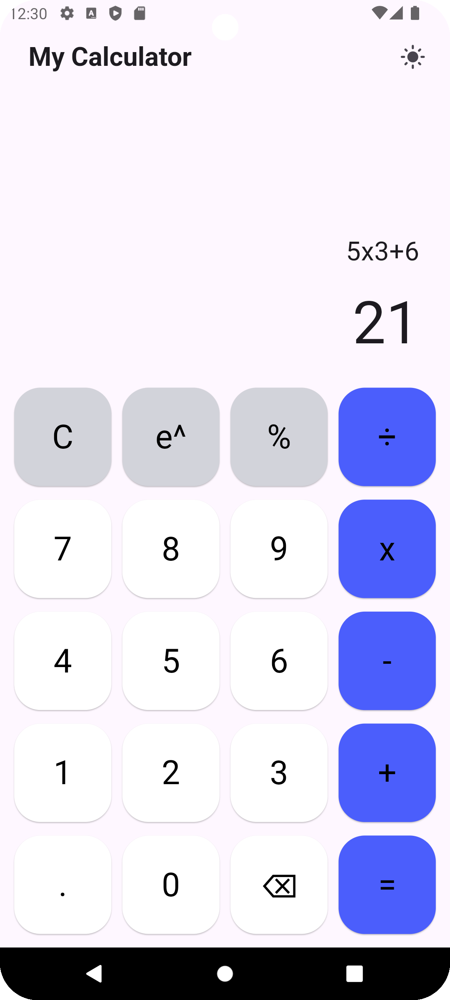
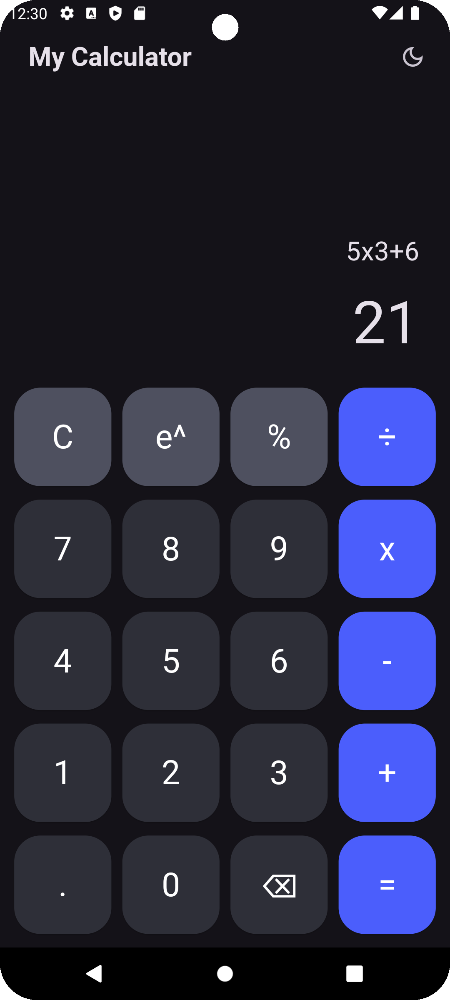

# Flutter Calculator with BLoC

A simple calculator app built using Flutter and BLoC state management. It supports basic arithmetic operations and provides a responsive, user-friendly interface.

## Features
- Basic arithmetic operations (+, -, *, ÷, ^, %)
- Real-time input handling with BLoC
- Light and Dark mode themes
- Displays results with formatted numbers (e.g., 1,000,000)
- Responsive design for different screen sizes

## Design Reference
figma = https://www.figma.com/community/file/1041082497681424521

## Screenshot

## Demo Video

YouTube link : https://youtu.be/elJL29F6bZg

## Getting Started

This project is a starting point for a Flutter application.

A few resources to get you started if this is your first Flutter project:

- [Lab: Write your first Flutter app](https://docs.flutter.dev/get-started/codelab)
- [Cookbook: Useful Flutter samples](https://docs.flutter.dev/cookbook)

For help getting started with Flutter development, view the
[online documentation](https://docs.flutter.dev/), which offers tutorials,
samples, guidance on mobile development, and a full API reference.
